\tableofcontents
\pagebreak

# Primera parte - Ingeniería Inversa

## Objetivo

El objetivo de la primera parte de este primer laboratorio fue realizar una ingeniería inversa a una serie de ejecutables. Para ello, fue necesario:
1. Comprender el programa(su lógica de ejecución).
2. Analizar sus firmas, metadata y demás parámetros.
3. En base a lo analizado, utilizar la herramienta apropiada para desensamblar el ejecutable y modificarlo.

## Programas utilizados

- [dnSPY](https://github.com/dnSpy/dnSpy) - Dessambler para aplicaciones de .NET
- [PEstudio](https://www.winitor.com/) - Utilizado para obtener las firmas, metadata, strings, imports, exports y demás de los archivos.
- [Ida Free](https://hex-rays.com/ida-free/) - Utilizado para decompilar los binarios a assembler.

## Desarrollo

### Archivo 1 - Crackme.exe

Este ejecutable pedía un id de 4 dígitos y luego su respectiva contraseña. Se pretendía hacer un bypass de la contraseña.

Este archivo fue el más sencillos de todos, ya que a través de *PEstudio* se verificó que el programa fue desarrollado con el entorno de *.NET* (im.1), con lo cual se utilizó *dnSPY* para desensamblar el código. El beneficio de *dnSPY* al *Ida Free* es que el primero nos otorga el código fuente del ejecutable, ahorrando así el manejo del código assembler. (im.2,3)

Al analizar el código se llegó a la conclusión de que la contraseña estaba en verdad en función del id y se calculaba dinámicamente en runtime. La fórmula que quedó fue:

$$
p(x) = Int(\frac {x * 786 * 17} {12} + 1991)
$$

Donde $p$ representa la contraseña y $x$ el id del usuario.

De esta manera, sencillamente se desarrolló un key generator en *c*:

\pagebreak

```c
#include <stdlib.h>

int calculateValidCode(int user_id)
{
	int x = user_id*786*17 / 12;
	return x + 1991;
}

int main(int argc, char*argv)
{
	if(argc == 1) {
    	printf("You must provide your user id as an argument");
    	return 1;
	}
    
	char arg = argv[1];
	int user_id = atoi(arg);
	if(user_id <= 0 || user_id >= 10000) {
    	printf("User id must be a 4 digits number");
    	return 1;
	}
    
	printf("Valid code is: %d", calculateValidCode(user_id));
}
```

Debajo se detallan las capturas de pantalla del proceso llevado a cabo:

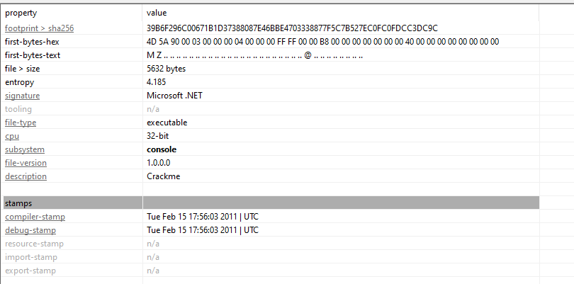

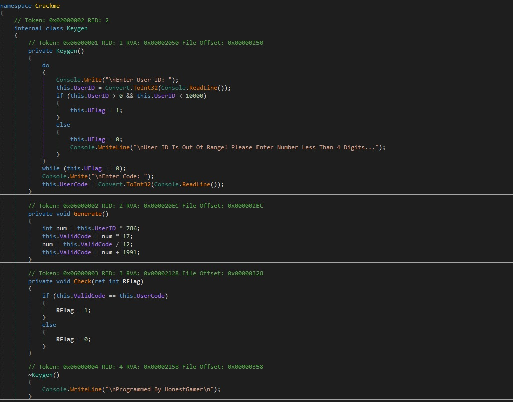

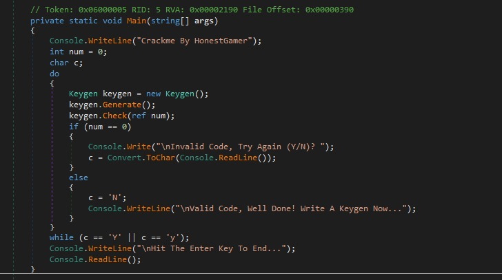

### Archivo 2 - Encuentre la contraseña

Este ejecutable simplemente pedía una contraseña. Se pretendía hacer un bypass de la contraseña.

Nuevamente mediante *PEstudio* se verifica que la firma del programa. Este caso es distinto al anterior, ya no se está ante un programa de .NET, sino c++ (im.1). Por lo tanto no es posible utilizar *dnSPY* y se deberá analizar el código en assembler utilizando el *Ida Free*.

Al analizar el código assembler se ve que se cargan en memoria dos variables **Str1** y **Str2** (im.2). La primera corresponde al input del usuario y la segunda es la verdadera contraseña. Entonces, para ver su valor, simplemente se ejecuta el Ida con el debugger (im.3) y se coloca una *stop* en el momento de la comparación, luego se revisan los registros de memoria y se llega a que el valor de la contraseña es ***superbad*** (im.4).

Por otro lado, se puede observar que el código tiene dos ramas de ejecución:
1. *loc_40102C*: Ejecución normal y loopea si la contraseña fue incorrecta.
2. *loc_4010B5*: la contraseña introducida fue correcta

Ahora se pretende directamente saltar a la rama 1 independientemente del valor de la contraseña introducida. Para ello, a través del *Ida free* se identifica la instrucción **jz** que realiza el salto condicional a *Loc_4010B5* y se la intercambia por una del tipo **jmp** la cual saltará directamente sin condiciones. Para esto, es necesario cambiar el código en format hex de **jz** el cual es **74**  al de **jmp** el cual es **EB** (im.5).

Deb se detallan las capturas de pantalla del proceso llevado a cabo:

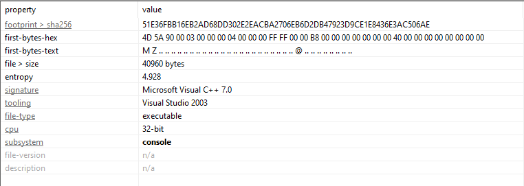

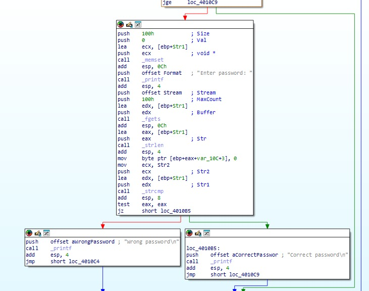

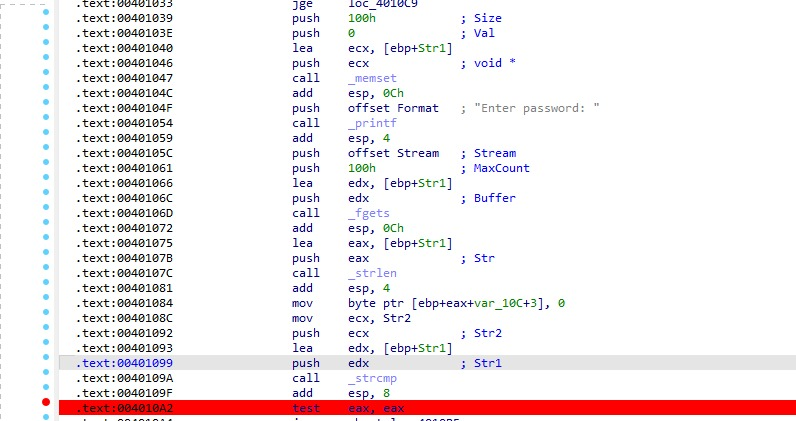

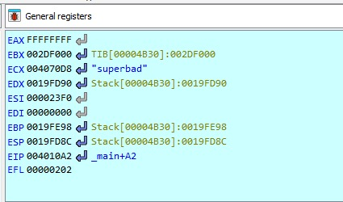

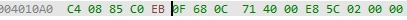

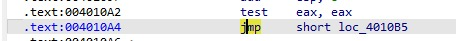


### Archivo 3 - Remove check

Este ejecutable pide el nombre de una organización y su respectiva contraseña. Se pretendía hacer un bypass de autenticación.

Como se vino realizando, utilizamos *PEstudio* (im.1) para ver la firma del programa. Nuevamente el programa fue desarrollado con c++. Por tanto, se procede a analizar el código assembler. En el mismo se puede observar que se realiza una comparación entre el el nombre de la organización introducido y el código serial y si ambos son iguales entonces la autenticación es correcta. (im.2)

Al igual que el anterior, se quiere que se salte a la rama de ejecución donde la autenticación es exitosa independientemente de los valores ingresados, para lo cual es necesario ignorar la instrucción **jz** (im.3) que salta a la ruta incorrecta en caso de que no coincidan los valores ingresados. Para ello, modificamos el hex code de **jz** por **90** el cual corresponde a la instrucción **nop** la cual no produce ningún efecto (im.4,5).

Debajo se detallan las capturas de pantalla del proceso llevado a cabo:

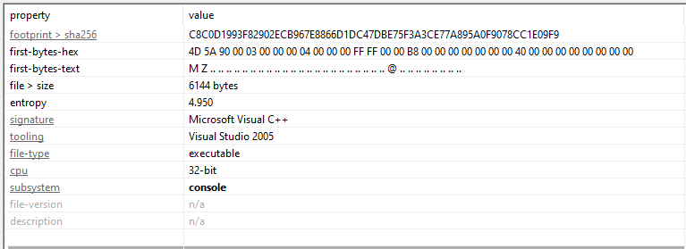

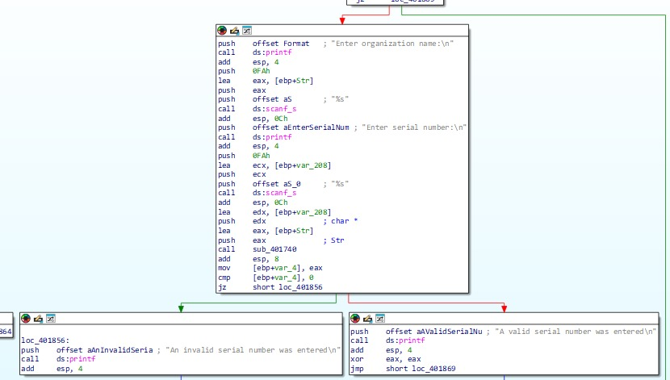

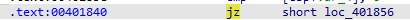

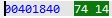

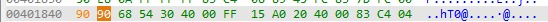

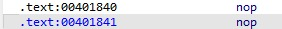

\pagebreak

# Parte 2 - Challenges RingZero

## Objetivo

El propósito de esta segunda parte es resolver una serie de desafíos del sitio [RingZero](https://ringzer0ctf.com/home). El objetivo de los desafíos es encontrar una key escondida que comienza con el prefijo *flag*.

## Challenge 18 - Look inside the house

Para resolver este desafío hay que descargar un archivo. El mismo contiene una imagen tipo *jpg* donde se observa una casa decorada de Kitty. Esto nos da la pauta de que este es un desafió de esteganografía, es decir la key esta escondida en la imagen.

Analizando la imagen y prestando atención a los detalles no se ve nada que llame la atención y que de pista alguna de la flag. El siguiente paso es corroborar que no exista un archivo escondido dentro de la imagen. Para ello, se utiliza la herramienta [stegseek](https://github.com/RickdeJager/stegseek).

Primero se verifica si realmente hay data escondida:

```bash
stegseek --seed 3e634b3b5d0658c903fc8d42b033fa57.jpg`
 Found (possible) seed: "3b75655e"        	 
    Plain size: 58.0 Byte(s) (compressed)
    Encryption Algorithm: rijndael-128
    Encryption Mode:  	cbc
```

Se concluye que hay datos encriptados en la imagen, entonces se procede a desencriptarlos. Para ello corremos *stegseek* con la flag *--crack*, la cual tratará de hallar la clave por fuerza bruta haciendo uso de una wordlist.

```bash
stegseek --crack 3e634b3b5d0658c903fc8d42b033fa57.jpg
StegSeek 0.6 - https://github.com/RickdeJager/StegSeek
[i] Found passphrase: ""
[i] Original filename: "flag.txt".
[i] Extracting to "3e634b3b5d0658c903fc8d42b033fa57.jpg.out".
```

Se ve que hay un flag.txt veamos su contenido

```bash
cat 3e634b3b5d0658c903fc8d42b033fa57.jpg.out
FLAG-5jk682aqoepoi582r940oow
```

Hemos encontrado la key: **FLAG-5jk682aqoepoi582r940oow**.

## Challenge 71 - Victor Reloaded

Este desafío nos plantea un texto. El mismo se trata de un poema del escritor francés Victor Hugo, más específicamente de *Viens ! - une flûte invisible*.

Al buscar la versión original y compararlos, automáticamente uno se da cuenta que los dos textos difieren entre sí. Utilizando la siguiente [herramienta](https://text-compare.com/), se puede ver en detalles cuáles son las diferencias entre ambos. Debajo se muestra el resultado de la comparación.

|  Modificado                             	| Original                              	|
| ----------------------------------------- | ---------------------------------------- |
| Viens ! - une **ph**lûte invisibe     	| Viens ! - une **f**lûte invisib**l**e	|
| Soupire d**e**ns les ver**j**ers. -   	| Soupire d**a**ns les ver**g**ers. -  	|
| La ch**e**nson la plus paisible       	| La ch**a**nson la plus paisible      	|
| Est la chanson des berge**é**s.       	| Est la chanson des berge**r**s.      	|
| Le v**a**nt ride, sous l'yeuse,       	| Le v**e**nt ride, sous l'yeuse,      	|
| La cha**m**son la plus joyeuse        	| La cha**n**son la plus joyeuse       	|
| Est la chanson des o**y**seaux.       	| Est la chanson des o**i**seaux.      	|
| La **s**hanson la plus charmante      	| La **c**hanson la plus charmante     	|
| Est la chanson d**ai**s amours.**&nbsp;** | Est la chanson d**e**s amours.**&nbsp;** |

Si se hace el recuento de palabras cambiados en el original nos queda: **flagarenice** que no es otra cosa que la solución del desafío!

\pagebreak

# Conclusión

En la primera parte del laboratorio, aprendimos a desensamblar y modificar ejecutables, comprendiendo su lógica de ejecución, manipulando firmas, metadata y otros parámetros.

Por otro lado, en la segunda parte, aplicamos diversas herramientas para resolver desafíos de esteganografía y análisis de textos.

En resumen, este primer laboratorio fue una excelente introducción general a dos grandes áreas de la ciberseguridad como lo son: la ingeniería inversa y la estaganografia. El mismo nos permitió obtener una mirada más práctica de esta disciplina luego de toda la teoría dada.

PD: Mi parte favorita fue usar el Ida :)


